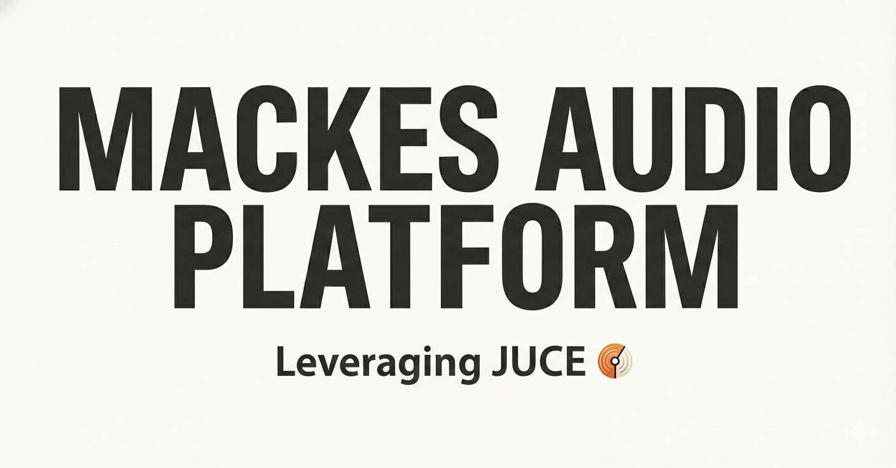

# MACKES AUDIO PLATFORM

Welcome to the MACKES Audio Platform, a suite of powerful and versatile VST3 plugins for professional audio production. This collection offers a wide range of effects, from classic modulation and time-based effects to detailed amplifier simulations.

## VST3 Plugins Overview

Here is a list of the included plugins with a brief overview of their features.

---

### Amp Simulators

#### Marshall800Plugin
A faithful digital recreation of the legendary Marshall JCM800 guitar amplifier. Known for its iconic rock and metal tones.
*   **Features:**
    *   Detailed gain and tone controls.
    *   Multiple cabinet and microphone simulations.
    *   Realistic tube amp saturation.

#### MesaDualRectifierPlugin
Emulates the Mesa/Boogie Dual Rectifier, a high-gain amplifier famous for its heavy and aggressive tones.
*   **Features:**
    *   Multiple channels for versatile sound shaping.
    *   Switchable rectifier modes (tube/silicon diode).
    *   Comprehensive EQ section.

#### Peavey5150Plugin
A simulation of the Peavey 5150 amplifier, designed in collaboration with Eddie Van Halen. Delivers high-gain lead and rhythm tones.
*   **Features:**
    *   Lead and Rhythm channels with independent controls.
    *   Presence and Resonance controls for power amp shaping.
    *   Built-in effects loop.

#### TweedBassmanPlugin
Modeled after the classic Fender Bassman amplifier. A versatile amp that sounds great on guitar, bass, and even vocals.
*   **Features:**
    *   Warm, clean tones that break up nicely when pushed.
    *   Simple and effective tone controls.
    *   A favorite of many legendary guitarists.

#### WDFAmpPlugin
A Wave Digital Filter based amplifier simulation. This plugin uses advanced modeling techniques to create a highly realistic and responsive amplifier sound.
*   **Features:**
    *   Detailed control over the amp's internal components.
    *   Low-latency performance.
    *   Wide range of tones, from clean to high-gain.

#### NAMPlugin
Neural Amp Modeler (NAM) plugin. This plugin uses neural networks to capture the sound and feel of real amplifiers.
*   **Features:**
    *   Load your own amp models created with NAM.
    *   Low CPU usage.
    *   Growing library of community-created models.

---

### Modulation & Pitch Effects

#### EDUCATIONALXS1PolyShifterPlugin
A polyphonic pitch shifter effect for creating harmonies and complex textures.
*   **Features:**
    *   Multiple pitch-shifting voices.
    *   Detune and feedback controls for chorus and flanger-like effects.
    *   Expression pedal input for real-time control.

#### ChorusPlugin
A classic chorus effect for adding depth and width to your sound.
*   **Features:**
    *   Rate, Depth, and Mix controls.
    *   Stereo and mono operation.
    *   Lush, vintage-inspired chorus tones.

#### EDUCATIONAL8VoiceChorusPlugin
An 8-voice chorus effect for incredibly rich and complex modulation.
*   **Features:**
    *   Eight independent chorus voices.
    *   Extensive modulation options.
    *   Create everything from subtle thickening to extreme detuning effects.

#### PhaserPlugin
A vintage-style phaser effect for creating swirling, psychedelic sounds.
*   **Features:**
    *   Rate, Depth, and Feedback controls.
    *   Multiple filter stages for different phaser flavors.
    *   Sync to host tempo.

#### PitchShifterPlugin
A simple and effective pitch shifter for transposing your audio up or down.
*   **Features:**
    *   Shift in semitones and cents.
    *   Mix control for blending the dry and wet signals.
    *   Low-latency algorithm.

#### ShoeGazePlugin
A multi-effect plugin designed for the shoegaze genre. Combines reverb, delay, and distortion for creating massive soundscapes.
*   **Features:**
    *   Chain multiple effects in any order.
    *   Dreamy and ethereal reverbs.
    *   Gritty and saturated distortions.

---

### Delay & Reverb Effects

#### CircularDelayPlugin
A delay effect with a feedback path that can be manipulated for interesting rhythmic and textural effects.
*   **Features:**
    *   Delay time can be synced to the host tempo.
    *   Feedback, Mix, and modulation controls.
    *   Create unique, evolving delay patterns.

#### ConvolutionPlugin
A convolution reverb plugin that uses impulse responses (IRs) to recreate the sound of real acoustic spaces.
*   **Features:**
    *   Load your own impulse response files.
    *   Pre-delay, EQ, and mix controls.
    *   Includes a library of high-quality IRs.

#### DelayPlugin
A straightforward delay plugin for adding echo and space to your tracks.
*   **Features:**
    *   Sync to host tempo or set delay time in milliseconds.
    *   Feedback and Mix controls.
    *   High-pass and low-pass filters in the feedback path.

#### LexiLovePlugin
A lush and spacious reverb effect, inspired by classic digital reverb units from the 1980s.
*   **Features:**
    *   Multiple reverb algorithms (Hall, Plate, Room, etc.).
    *   Decay, Pre-delay, and Mix controls.
    *   Modulation for creating rich, evolving reverb tails.

---

### Utility & Other Effects

#### DynamicsPlugin
A versatile dynamics processor that can be used as a compressor, expander, gate, or limiter.
*   **Features:**
    *   Threshold, Ratio, Attack, and Release controls.
    *   Sidechain input for frequency-dependent compression.
    *   Soft and hard knee modes.

#### EDUCATIONALH9Plugin
A multi-effects plugin with a wide range of algorithms, from reverb and delay to pitch-shifting and modulation.
*   **Features:**
    *   Dozens of high-quality effect algorithms.
    *   Intuitive user interface for easy sound design.
    *   Expression pedal and MIDI control.

#### FilterPlugin
A flexible filter plugin with multiple filter types and modulation options.
*   **Features:**
    *   Low-pass, high-pass, band-pass, and notch filters.
    *   Envelope follower and LFO for filter modulation.
    *   Resonance control for creative filter sweeps.

#### H3000Plugin
A recreation of the legendary H3000 Ultra-Harmonizer. Known for its unique pitch-shifting, delay, and modulation effects.
*   **Features:**
    *   Includes many of the original H3000 algorithms.
    *   Wide range of creative and experimental effects.
    *   A must-have for sound designers and electronic musicians.

#### ParallelMixerPlugin
A utility plugin for blending multiple audio signals in parallel.
*   **Features:**
    *   Mix up to 8 channels in parallel.
    *   Phase and level controls for each channel.
    *   Useful for parallel compression and other advanced mixing techniques.

#### PassionFXPlugin
A creative multi-effect plugin for mangling and transforming your audio.
*   **Features:**
    *   Combines granular synthesis, delay, and filtering.
    *   Unique and unpredictable results.
    *   Perfect for experimental music and sound design.
